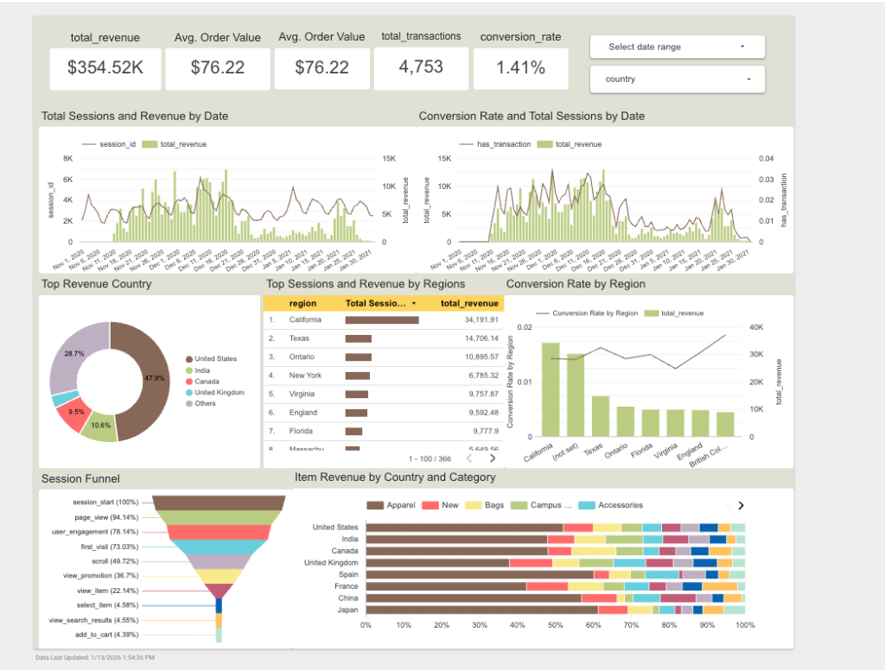

# E-commerce Revenue Intelligence & Funnel Optimization
**From raw GA4 events to board-ready dashboards**

[**View Live Looker Studio Dashboard**](https://lookerstudio.google.com/reporting/db8290ae-d10d-45f9-9cdb-1df9a85a5fff)

## Summary
This project converts raw Google Analytics 4 (GA4) export data into **trusted, analysis-ready reporting tables** and a **Looker Studio dashboard** for monitoring and diagnosing **revenue** and **funnel performance**.

**Primary outputs**
- **Reporting tables** (session-level + product/item-level) for fast, consistent querying
- **Looker Studio dashboard** for KPI trends, funnel visualization, and product performance
- **Data quality visibility layer** (tests + DQ reporting table) to surface issues transparently

## Overview
Build a reusable analytics pipeline that converts raw GA4 export data into trusted, analysis-ready tables and a dashboard that makes revenue and funnel performance easy to monitor and diagnose. The output is a consistent “single source of truth” for core e-commerce metrics and funnel insights.

Small teams rely on GA4 to understand user behavior and revenue performance, but raw GA4 event data is difficult to work with, leading to inconsistent metrics, slow ad-hoc analysis, and missed insights.

As a result, stakeholders spend time cleaning and reconciling data instead of making decisions, which delays optimization of marketing spend, conversion funnels, and product strategy.

This matters more now because teams have more channels, more events, and higher expectations for fast reporting without having dedicated analytics engineering support.

### Target users
**Primary**
- **Marketing team**: acquisition performance, landing page impact, and conversion funnel visibility  
- **E-commerce / revenue owner**: revenue trends, product performance, and “why did revenue change?” answers  
- **Analyst**: clean tables + consistent definitions to answer questions quickly without rebuilding logic  

**Secondary**
- **Leadership**: reliable weekly/monthly reporting and a stable KPI view  
- **Engineering/Product**: funnel drop-offs to prioritize UX/product changes  

### User problems
- GA4 export is complex (nested parameters/items), making analysis slow and error-prone  
- KPI definitions (sessions, conversions, revenue) become inconsistent across ad-hoc queries and dashboards  
- Teams can see “what happened” (revenue up/down) but struggle to see “why” (which channel, which step, which product)  

### Goals (what success looks like)
- Stakeholders can answer key questions about **acquisition, funnel, and product sales** quickly  
- Core metrics are **defined once** and reused consistently across reporting  
- Data quality issues are **visible and explainable** (flagged, not silently dropped)  

### Key use cases
1. **Weekly revenue review** — “How did revenue, AOV, conversion rate change vs last week?”  
2. **Funnel diagnosis** — “Where are users dropping off (view item → add to cart → begin checkout → purchase)?”  
3. **Acquisition performance** — “Which channels drive high conversion vs high traffic but low conversion?”  
4. **Product performance** — “Which products drive revenue and which have high views but low conversion?”  

### Solution approach
- Convert raw GA4 events into curated reporting tables that:
  - flatten nested structures into analysis-friendly columns  
  - standardize key business definitions (session, conversion, revenue)  
  - include quality checks and flags for anomalies/missing keys  
- Power a Looker Studio dashboard from curated tables to keep queries fast and consistent  

### Primary deliverables
- **Two curated reporting tables** (session-level + product/item-level) designed for fast dashboarding  
- **A Looker Studio dashboard** with KPI trends, funnel visualization, and product performance  
- **A data quality visibility layer** (tests + DQ reporting table) to surface issues transparently  

## Definitions 

### Session
**Def:** Events grouped into one session using `user_pseudo_id + ga_session_id`.  
**Reason:** `ga_session_id` alone isn’t unique across all users, so combining it with the user ID makes a reliable session key.

### Conversion
**Def:** A session that includes at least one `purchase` event.  
> This matches the business meaning of “a session that resulted in a purchase” and keeps reporting consistent.

### Revenue
**Def:** Sum of the GA4 `value` parameter on `purchase` events.  
> `value` is GA4’s recorded purchase value in the export and provides a single consistent revenue source for reporting.

### Funnel (event-based)
**Def:** A session “reaches” a funnel stage if it contains that stage’s event.  
> GA4 data is event-driven and users can skip steps; event-based stages keep the funnel measurable and consistent.

**Stages**
- Product view: `view_item`  
- Add to cart: `add_to_cart`  
- Checkout: `begin_checkout`  
- Purchase: `purchase`  

## Data model 
To power interactive dashboards without lag, this project pre-computes **wide reporting tables** (minimizing heavy joins at query time).

- **`rpt_sessions_wide`** (one row per session)
  - Enriched geography (country/region/city)
  - Session context (start time, duration, device)
  - Commerce metrics (`total_revenue`, `total_transactions`, conversion flags)
  - Funnel stage flags (view/add_to_cart/begin_checkout/purchase)

- **`rpt_product_sales`** (one row per line item)
  - Product performance metrics (item revenue, quantity, item views where available)
  - Session context columns carried through (geo/channel/device) for slice-and-dice without re-joins

## Data quality & trust
- **Standardized definitions**: sessions/conversions/revenue are defined once and reused everywhere  
- **Transparency over silent dropping**: anomalies (e.g., missing transaction identifiers) are **flagged** into a DQ reporting table for stakeholder review  

**DQ reporting**
- `rpt_purchase_dq_analysis` surfaces issues (counts + revenue impact) so stakeholders can see what’s affected and why

## Insights 
### Interactive Insights
The new data model powers the **Looker Studio Dashboard**, enabling instant answers to:
- **Funnel Analysis**: Identify the **80.3%** drop-off between "View Item" and "Add to Cart" to prioritize PDP improvements. 
- **Regional Performance**: Texas shows a **2.27%** conversion rate, outperforming California (**1.87%**) despite lower traffic volume. 
- **Device Optimization**: Mobile users convert at **1.4%**, slightly edging out Desktop users (**1.3%**), guiding our "Mobile-First" design strategy. 

### Data Quality Analysis 
- **Transparency**: The pipeline identified **1,800 purchase lines** (approx. $32k revenue) with missing Transaction IDs. 
- **Action**: Instead of filtering these out, they are flagged in rpt_purchase_dq_analysis for stakeholder review, ensuring 100% of revenue data is visible while maintaining data governance.

## Roadmap (next improvements)
- Add/strengthen incremental refresh strategy and freshness checks  
- Expand funnel diagnostics (segment by channel/device/geo, include time-to-convert)  
- Add operational run logs (run status, duration, bytes processed) and a lightweight runbook  
