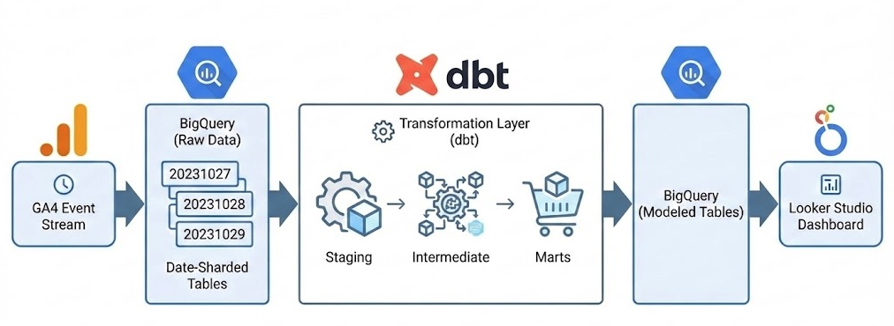
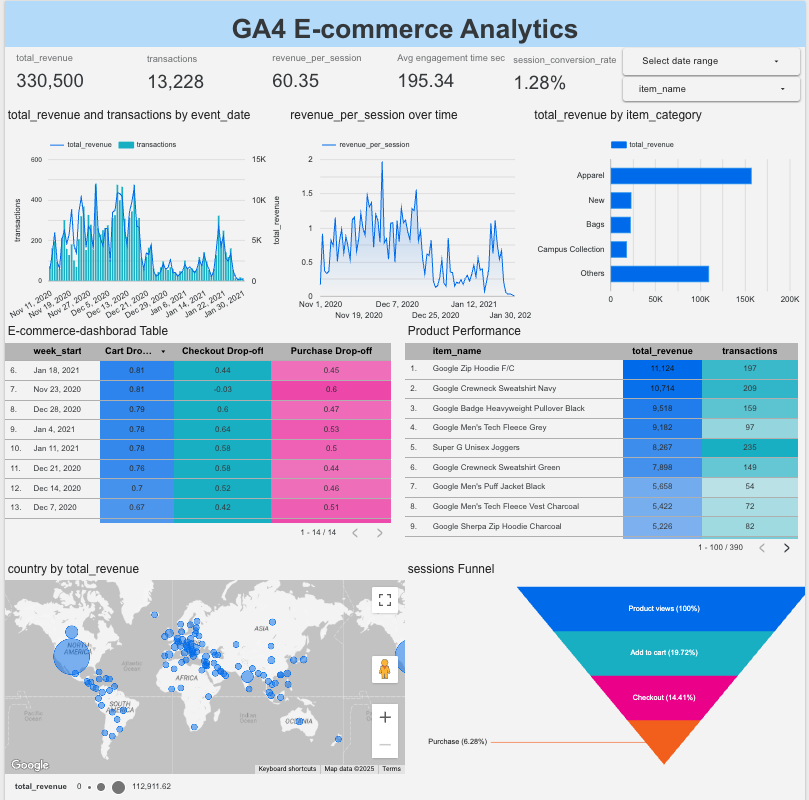
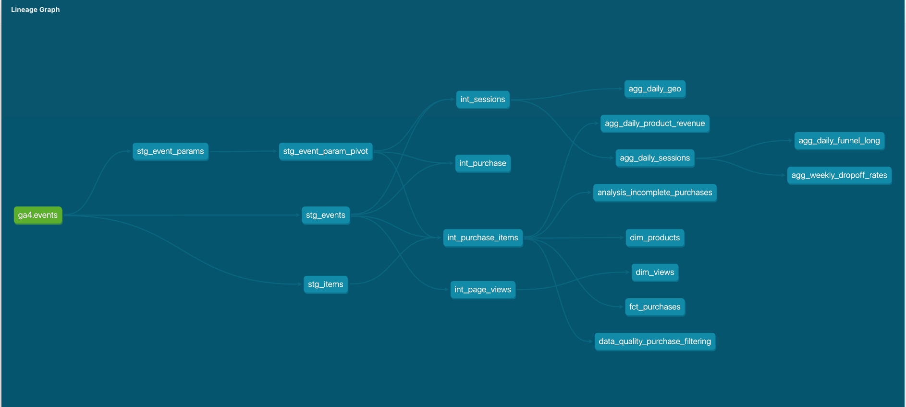

# dbt Core + BigQuery: GA4 E-commerce Analytics Pipeline

<!--  -->

## Project Overview

This project is a production-ready dbt data pipeline that transforms the [Google Analytics 4 sample e-commerce dataset](https://developers.google.com/analytics/bigquery/web-ecommerce-demo-dataset) into structured data models for business analytics.

This pipeline is designed for e-commerce teams using GA4 who struggle with complicated funnel metrics, conversion drop-offs, and revenue reporting. It transforms raw GA4 events into cleaned tables for analysis.

- Stack: dbt Core + BigQuery + Looker Studio
- Goal: Reliable GA4 funnel + revenue models for analytics
- Outputs: session/day aggregates, funnel tables, product revenue marts
- DQ: schema + relationship tests + filtered purchase anomaly handling (~11%)

## Data Source

**Source**: `bigquery-public-data.ga4_obfuscated_sample_ecommerce.events_*`

This public dataset contains GA4 event data from a real e-commerce website, including:
- Page views — user interactions
- Product views — add-to-cart events
- Checkout — purchase transactions
- User sessions with device/geo information

**Date Range**: November 1, 2020 – January 31, 2021

---

## Key Analytics Features

Note: This public GA4 dataset is obfuscated for privacy (anonymized identifiers), but it preserves real event structure and session behavior

### Session Analytics (`agg_daily_sessions`)
- **User Engagement**: Session duration, pages per session, bounce rate
- **New vs Returning**: Tracks first-time vs repeat visitors
- **Conversion Funnel**: Product views — Add to cart — Checkout — Purchase
- **Revenue Metrics**: Total revenue, average order value, revenue per session

### E-commerce Analytics
- **Transaction Tracking**: Full purchase history with line-item detail
- **Product Performance**: Daily revenue by product
- **User Behavior**: Session-level engagement and conversion tracking

## Live Dashboard

Explore the analytics visually with the **Looker Studio Dashboard**:

**[View Dashboard](https://lookerstudio.google.com/reporting/ff72ef08-e8a3-4938-872f-98c45a86ab26)**

This dashboard connects to the BigQuery marts layer and shows:
- Daily session and conversion metrics
- Product performance analytics
- E-commerce funnel visualization
- Revenue trends and insights

## Sample Insights

### High-Value iOS Traffic
Recent analysis shows that **iOS users** demonstrate the highest conversion rate (**1.38%**), outperforming Web (1.35%) and Android (1.33%). This suggests a highly engaged mobile user base on Apple devices.

## Business Questions Answered
1. Where do users drop off the most in the purchase funnel?
- The largest drop-off happened at the Add to Cart stage, where only -19.6% of users who viewed a product added it to the cart. Over 80% of users who viewed a product never added it to the cart.

2. How efficient is the checkout process?
- -47.5% of users proceed from Add to Cart to Checkout.

3. Which product categories generate the most revenue per transaction?
- Gift Cards has highest revenue per transaction with an average of $309 per transaction.
- Second highest revenue per transaction is Black Lives Matter items at $58,

4. When is the best sales days?
- The highest daily sales is 2020-11-30 ($12,009), followed by 2020-12-16 ($11,491) and 2020-12-10 ($10,773).
- These days are likely related to Black Friday/Cyber Monday  also Christmas sales events since 2020-12-24/25 are the lowest sales days.

5. Which browser drives the most sessions?
- Chrome is the primary driver of traffic (84%) and conversion impact, while Safari is around 16%, a smaller but still significant segment.

## Model Layers

### Staging Layer
Lightweight views that clean:

| Model | Description |
|-------|-------------|
| `stg_events` | Core event data with parsed dates, timestamps, and unique event IDs |
| `stg_event_params` | Flattened event parameters from nested arrays |
| `stg_items` | Product/item data extracted from purchase events |
| `stg_event_param_pivot` | Pivoted parameters with ga_session_id, page_location, transaction_id, etc. |

### Intermediate Layer
Business logic transformations that join:

| Model | Description |
|-------|-------------|
| `int_sessions` | Session-level aggregates with engagement metrics, conversion flags, and revenue |
| `int_purchase_items` | Transaction line items with product details and calculated revenue |
| `int_page_views` | Page view events enriched with session context |

### Marts Layer
Analytics-ready tables optimized for reporting:

| Model | Description |
|-------|-------------|
| `fct_purchases` | Transaction-level fact table with item counts and revenue |
| `dim_products` | Product dimension with unique products from the catalog |
| `dim_views` | Daily page view aggregates with unique user counts |
| `agg_daily_sessions` | Daily session metrics including conversion rates, bounce rates, and revenue |
| `agg_daily_product_revenue` | Daily product performance with revenue aggregation |
| `agg_daily_funnel_long` | Funnel analysis in long format: product views — add to cart — checkout — purchase |

## Data Quality

All models include schema tests defined in `schema.yml` files:

- **Primary Keys**: Uniqueness and not-null constraints
- **Required Fields**: Not-null tests on critical columns
- **Referential Integrity**: Relationship tests between models

### Filtered Data Monitoring
Analysis reveals that **~11% of purchase records** were filtered due to incomplete data, primarily caused by a tracking misconfiguration. This pipeline automatically filters these incomplete records in the marts layer to ensure analytical accuracy.

## Documentation

This project includes auto-generated dbt documentation with:
- Model lineage graphs showing data flow
- Column descriptions and data types
- Test coverage and data quality rules

