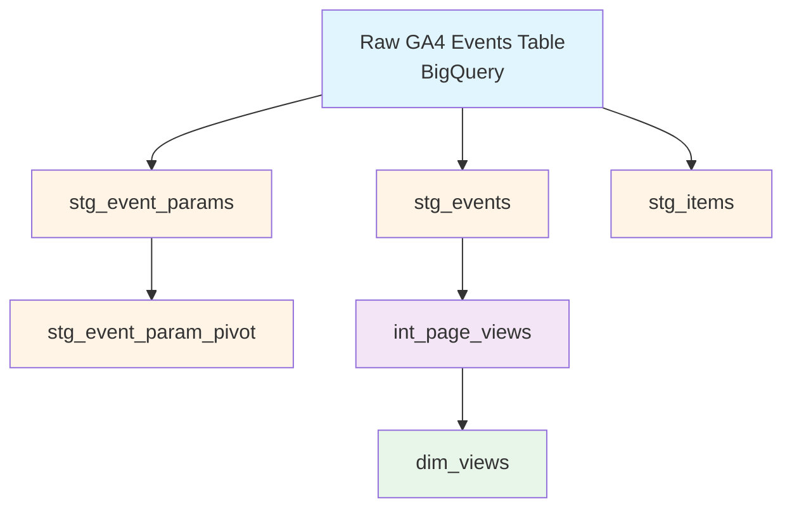

# GA4 dbt Data Pipeline Walkthrough

## Overview

You're building a **Google Analytics 4 (GA4) data pipeline** in BigQuery using dbt. Here's what data you have and how it flows:

---

## 🗂️ Data Flow Architecture



---

## 📊 Layer-by-Layer Breakdown

### **Layer 1: Source (Raw Data)**

**Table:** `ga4.events_*` (BigQuery partitioned table)

**What it contains:**
- Raw Google Analytics 4 event data
- Each row = one event (page view, click, purchase, etc.)
- Nested/repeated fields (arrays and structs)
- Date range: `20201101` to `20201107` (Nov 1-7, 2020)

**Sample structure:**
```
event_date: "20201101"
event_timestamp: 1604188800000000
event_name: "page_view"
user_pseudo_id: "1234567890.1234567890"
event_params: [
  {key: "page_location", value: {string_value: "https://example.com"}},
  {key: "ga_session_id", value: {int_value: 1234567890}}
]
items: [
  {item_id: "SKU123", item_name: "Product A", price: 29.99}
]
```

---

### **Layer 2: Staging (Light Transformations)**

#### **stg_events** (Main events table)
- **Purpose:** Clean core event fields
- **Transformations:**
  - Parse `event_date` string → DATE type
  - Convert `event_timestamp` microseconds → TIMESTAMP
  - Generate unique `event_id` (hash of user + timestamp + event_name)
- **Row count:** ~1,000 events (with limit)
- **Use case:** Base table for all event analysis

#### **stg_event_params** (Unnested parameters)
- **Purpose:** Flatten event parameters array
- **Transformations:**
  - Unnest `event_params` array (one row per parameter per event)
  - Keep all value types (string, int, float, double)
- **Row count:** ~5,000-10,000 rows (multiple params per event)
- **Use case:** When you need specific event parameters

**Example output:**
```
event_id | param_key      | string_value           | int_value
---------|----------------|------------------------|----------
abc123   | page_location  | https://example.com    | null
abc123   | ga_session_id  | null                   | 1234567890
```

#### **stg_event_param_pivot** (Wide format parameters)
- **Purpose:** Pivot common parameters into columns
- **Transformations:**
  - Pivot key parameters (session_id, page_location, etc.) into columns
  - One row per event (not per parameter)
- **Row count:** ~1,000 events
- **Use case:** Easier querying without unnesting

**Example output:**
```
event_id | ga_session_id | page_location           | page_referrer
---------|---------------|-------------------------|---------------
abc123   | 1234567890    | https://example.com     | https://google.com
```

#### **stg_items** (Unnested items)
- **Purpose:** Flatten items array (e-commerce products)
- **Transformations:**
  - Unnest `items` array (one row per item per event)
  - Extract item details (id, name, brand, category, price, quantity)
- **Row count:** Varies (depends on items per event)
- **Use case:** E-commerce product analysis

---

### **Layer 3: Intermediate (Business Logic)**

#### **int_page_views**
- **Purpose:** Filter and clean page view events
- **Transformations:**
  - Filter to only `event_name = 'page_view'`
  - Remove null user_pseudo_id and event_date
  - Select relevant columns for page view analysis
- **Row count:** ~500-700 page view events
- **Use case:** Foundation for page view metrics

---

### **Layer 4: Marts (Analytics-Ready)**

#### **dim_views** (Daily page view metrics)
- **Purpose:** Aggregated daily page view statistics
- **Transformations:**
  - Group by `event_date`
  - Count total page views
  - Count unique users
- **Row count:** 7 rows (one per day, Nov 1-7)
- **Use case:** Dashboard showing daily page views and unique visitors

**Example output:**
```
event_date  | total_page_views | unique_users
------------|------------------|-------------
2020-11-01  | 150              | 45
2020-11-02  | 180              | 52
2020-11-03  | 165              | 48
```

---

## 🎯 What Data You Actually Have

### **Current State:**
✅ **6 models built:**
1. `stg_events` - 1,000 events (all types)
2. `stg_event_params` - ~5,000+ rows (unnested parameters)
3. `stg_event_param_pivot` - 1,000 events (pivoted parameters)
4. `stg_items` - Variable rows (unnested e-commerce items)
5. `int_page_views` - ~500-700 page view events
6. `dim_views` - 7 rows (daily aggregates)

### **Data Limitations:**
⚠️ **Limited date range:** Only Nov 1-7, 2020 (7 days)
⚠️ **Row limit:** 1,000 events max in staging (can be removed)
⚠️ **Sample data:** This is likely test/demo data

---

## 🔄 Typical Workflow

### **When you want to analyze something:**

1. **Start with staging models** to understand raw data structure
2. **Create intermediate models** for filtering/cleaning specific use cases
3. **Build mart models** for final aggregations/reports

### **Example: Building a "User Sessions" analysis**

```
stg_events + stg_event_param_pivot
    ↓
int_user_sessions (group events into sessions)
    ↓
fct_daily_sessions (aggregate session metrics)
```

---

## 📈 Next Steps You Could Take

### **Potential new models:**

1. **int_user_sessions** - Group events into user sessions
2. **int_ecommerce_events** - Filter to purchase/add_to_cart events
3. **fct_daily_traffic** - Daily traffic sources analysis
4. **fct_product_performance** - Product sales metrics (using stg_items)
5. **dim_users** - User-level aggregates

### **To expand your data:**

- Remove the `limit 1000` in staging models
- Extend date range in variables (`ga4_start_suffix`, `ga4_end_suffix`)
- Add more event parameters to the pivot model

---

## 🎨 Visual Summary

**Your pipeline in plain English:**

> "I'm taking raw GA4 event data from BigQuery, cleaning it into staging tables, filtering page view events in an intermediate layer, and creating a daily page views summary table for dashboards."

**Current output:** A table showing daily page views and unique users for Nov 1-7, 2020.
